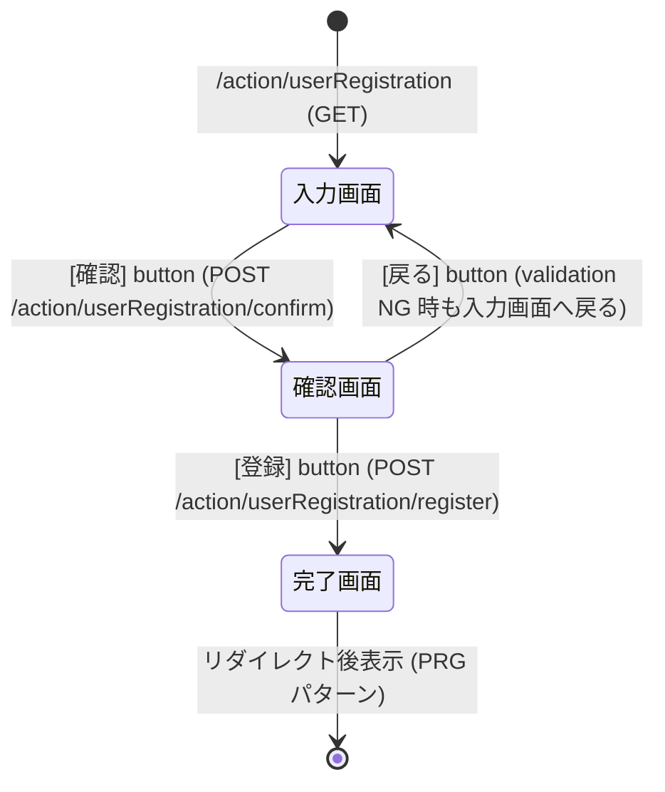

# ユーザー登録機能 外部設計書 (W11AC01)

| 項目 | 値 |
|------|----|
| 画面ID | W11AC01 |
| 画面名 | ユーザー登録 |
| 機能概要 | 新規ユーザーの登録を受付、確認→登録完了まで導く |
| 対象フレームワーク | Nablarch 5 |
| 設計根拠 | nabledge-5 `docs/processing-pattern/web-application/web-application-getting-started-project-update.md` / `web-application-client-create1.md` |
| 版数 | 1.0 |

---

## 1. 要件定義サマリ

| 項目 | 要件 |
|------|------|
| ユーザー名 | 必須、50 文字以内 |
| メールアドレス | 必須、Email 形式 |
| パスワード | 必須、8 文字以上の半角英数字 |
| 遷移 | 入力画面 → [確認] → 確認画面 → [登録] → DB 登録 → 完了画面 |

---

## 2. 画面遷移図



### 遷移一覧表

| No | 遷移元 | イベント | HTTP | URI | 遷移先 | 備考 |
|----|--------|----------|------|-----|--------|------|
| 1 | (起点) | 初期表示 | GET | `/action/userRegistration` | 入力画面 | input メソッド |
| 2 | 入力画面 | 確認押下 | POST | `/action/userRegistration/confirm` | 確認画面 | confirm メソッド / バリデーションエラー時は入力画面へフォワード |
| 3 | 確認画面 | 戻る押下 | GET | `/action/userRegistration` | 入力画面 | 入力値保持して再描画 |
| 4 | 確認画面 | 登録押下 | POST | `/action/userRegistration/register` | 完了画面(リダイレクト) | register メソッド / @OnDoubleSubmission 付与 |
| 5 | 完了画面 | (自動) | GET | `/action/userRegistration/complete` | 完了画面 | completeOfRegister メソッド / PRG パターンの着地 |

> **PRG パターン**:register 成功後 `303 redirect://completeOfRegister` でリダイレクトし、ブラウザ更新での二重登録を防止(Nablarch 推奨、`web-application-getting-started-project-update.md` 参照)。

---

## 3. 入力画面 HTML/JSP 構造 (Nablarch Custom Tag)

> 設計根拠:`web-application-client-create1.md` の `<n:form>` / `<n:text>` / `<n:button>` パターン。

ファイル:`/src/main/webapp/WEB-INF/view/userRegistration/input.jsp`

```jsp
<%@ page pageEncoding="UTF-8"%>
<%@ taglib prefix="n" uri="http://tis.co.jp/nablarch" %>

<n:form>
    <div class="form-group label-static is-empty">
        <label class="control-label">ユーザー名 <span class="req">*</span></label>
        <n:text name="form.userName" cssClass="form-control input-text"
                maxlength="50" placeholder="50 文字以内"/>
        <n:error name="form.userName"/>
    </div>

    <div class="form-group label-static is-empty">
        <label class="control-label">メールアドレス <span class="req">*</span></label>
        <n:text name="form.email" cssClass="form-control input-text"
                placeholder="例: user@example.com"/>
        <n:error name="form.email"/>
    </div>

    <div class="form-group label-static is-empty">
        <label class="control-label">パスワード <span class="req">*</span></label>
        <n:password name="form.password" cssClass="form-control input-text"
                    maxlength="100" placeholder="8 文字以上の半角英数字"/>
        <n:error name="form.password"/>
    </div>

    <div class="button-nav">
        <n:button uri="/action/userRegistration/confirm"
                  cssClass="btn btn-raised btn-success">確認</n:button>
    </div>
</n:form>
```

## 4. 確認画面 HTML/JSP 構造

> 設計根拠:`web-application-getting-started-project-update.md` の `<n:forInputPage>` / `<n:forConfirmationPage>` / `useToken="true"` パターン。

ファイル:`/src/main/webapp/WEB-INF/view/userRegistration/confirm.jsp`

```jsp
<%@ page pageEncoding="UTF-8"%>
<%@ taglib prefix="n" uri="http://tis.co.jp/nablarch" %>

<n:form useToken="true">
    <div class="form-group label-static">
        <label class="control-label">ユーザー名</label>
        <n:write name="form.userName" />
    </div>
    <div class="form-group label-static">
        <label class="control-label">メールアドレス</label>
        <n:write name="form.email" />
    </div>
    <div class="form-group label-static">
        <label class="control-label">パスワード</label>
        <n:write name="form.password" />
    </div>

    <div class="button-nav">
        <n:forInputPage>
            <!-- 入力画面向け (戻る等) -->
        </n:forInputPage>
        <n:forConfirmationPage>
            <n:button uri="/action/userRegistration"
                      cssClass="btn btn-default">戻る</n:button>
            <n:submit value="登録" uri="/action/userRegistration/register"
                      id="bottomSubmitButton"
                      cssClass="btn btn-raised btn-success"
                      allowDoubleSubmission="false" type="button" />
        </n:forConfirmationPage>
    </div>
</n:form>
```

> **ポイント**:二重サブミット防止のため `<n:submit>` の `allowDoubleSubmission="false"` を指定、`<n:form useToken="true">` でトークンチェックを有効化(`web-application-getting-started-project-update.md` 参照)。

## 5. 完了画面 HTML/JSP 構造

ファイル:`/src/main/webapp/WEB-INF/view/userRegistration/completeOfRegister.jsp`

```jsp
<%@ page pageEncoding="UTF-8"%>
<%@ taglib prefix="n" uri="http://tis.co.jp/nablarch" %>

<n:form>
    <div class="title-nav">
        <h1 class="page-title">ユーザー登録完了画面</h1>
    </div>
    <div class="message-area message-info">
        ユーザー登録が完了しました。
    </div>
</n:form>
```

---

## 6. フィールド精査(バリデーション)ルール表

> 設計根拠:`web-application-getting-started-project-update.md` の `@Required` / `@Domain` + `libraries-bean-validation.md`。

| No | 項目名 | 物理名 | Java型 | 桁数 | 精査ルール (Bean Validation) | 備考 |
|----|--------|--------|--------|------|------------------------------|------|
| 1 | ユーザー名 | userName | String | 50 | `@Required` + `@Length(max=50)` + `@Domain("userName")` | 必須・長さ上限 |
| 2 | メールアドレス | email | String | 254 | `@Required` + `@Email` + `@Length(max=254)` + `@Domain("email")` | RFC5321 上限 254 |
| 3 | パスワード | password | String | 100 | `@Required` + `@Length(min=8, max=100)` + `@Pattern(regexp="[0-9a-zA-Z]+")` + `@Domain("password")` | 半角英数字のみ |

### 精査ルールの補足

| ルール | 意味 | メッセージID |
|--------|------|--------------|
| `@Required` | 必須入力 | `nablarch.core.validation.required` |
| `@Length(max=N)` | 最大文字長 | `nablarch.core.validation.length.max` |
| `@Length(min=N, max=M)` | 文字長範囲 | `nablarch.core.validation.length.min` / `.max` |
| `@Email` | Email 形式 | `nablarch.core.validation.email` |
| `@Pattern(regexp=...)` | 正規表現一致 | `nablarch.core.validation.pattern` |
| `@Domain("xxx")` | ドメイン定義に基づく桁数・型検証 | `nablarch.core.validation.domain` |

> `@Domain` は `app.xml` の `<domain>` 設定に基づき、SQL 上の桁数(`VARCHAR2(50)` 等)と整合する桁数検証を自動付与する Nablarch 固有のアノテーション。

---

## 7. ルーティング定義 (routes.xml)

> 設計根拠:`web-application-client-create1.md` の http_request_router パターン。

```xml
<routes>
  <get  path="/action/userRegistration"                to="UserRegistration#input"/>
  <post path="/action/userRegistration/confirm"        to="UserRegistration#confirm"/>
  <post path="/action/userRegistration/register"       to="UserRegistration#register"/>
  <get  path="/action/userRegistration/complete"       to="UserRegistration#completeOfRegister"/>
</routes>
```

---

## 8. エラー一覧 (想定される業務例外)

| エラー区分 | メッセージID | 発生条件 | 遷移先 |
|------------|--------------|----------|--------|
| 入力エラー | `errors.required` | 必須項目未入力 | 入力画面(フォワード) |
| 入力エラー | `errors.length.max` | 桁数超過 | 入力画面 |
| 入力エラー | `errors.length.min` | 桁数不足(パスワード <8) | 入力画面 |
| 入力エラー | `errors.email` | Email 形式違反 | 入力画面 |
| 入力エラー | `errors.pattern` | 半角英数字以外 | 入力画面 |
| 業務エラー | `errors.duplicate.email` | メールアドレス重複 | 入力画面(データベース相関バリデーション) |
| 二重サブミット | (フレームワーク既定) | 同一トークン再送 | 入力画面 |

> メールアドレス重複チェックは `UniversalDao#exists` で DB 相関バリデーションとして実装(`web-application-getting-started-project-update.md` の `FIND_BY_CLIENT_ID` パターンを踏襲)。

---

## 9. 参照した nabledge-5 知識資産

| 資産パス | 用途 |
|----------|------|
| `docs/processing-pattern/web-application/web-application-getting-started-project-update.md` | 登録/更新フロー・Form/Action パターン・JSP 確認画面 |
| `docs/processing-pattern/web-application/web-application-client-create1.md` | 登録画面初期表示・`<n:form>` / `<n:text>` / `<n:button>` / routes.xml |
| `docs/component/libraries/libraries-bean-validation.md`(参照) | Bean Validation アノテーション |
| `docs/javadoc/javadoc-nablarch-common-web-interceptor-InjectForm.md` | `@InjectForm` |
| `docs/javadoc/javadoc-nablarch-common-web-token-OnDoubleSubmission.md` | `@OnDoubleSubmission` |
