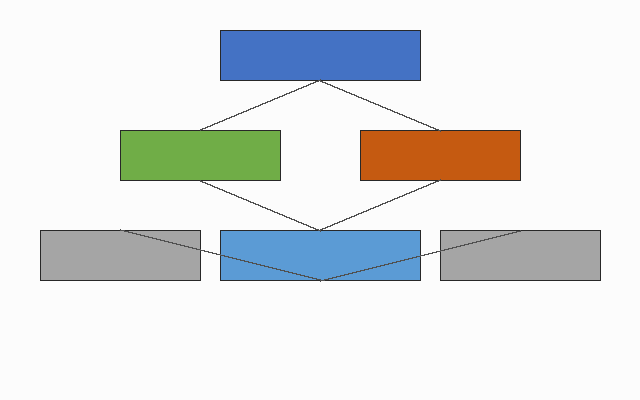

<!-- 由 OfficeCLI 从 Excel 自动转换生成 — 富文本版（VS Code / Typora / Obsidian 打开查看颜色） -->

# 设计总览

# 完整设计文档 — OfficeCLI 全功能验证

### 1. 文档信息

### 2. 修订记录

(历史修订 15)

(历史修订 16)

### 3. 术语定义

### 4. 格式验证矩阵

**Bold 加粗示例**

**斜体文本**
*这是斜体文本*

*Italic 示例*

**删除线文本**
~~这是删除线文本~~

~~废弃内容(删除线)~~

**红色字体**
红色字体

Red

**蓝色字体**
蓝色字体

Blue

**绿色字体**
绿色字体

Green

**灰色字体**
灰色字体

Gray

**黄色背景高亮**
<mark>黄色背景高亮</mark>

<mark>Highlight 标注</mark>

**蓝色背景**
蓝色背景

Blue bg

**下划线**
<u>下划线文本</u>

<u>Underline</u>

**加粗+红色组合**
**加粗+红色组合**

**Bold Red**

**删除线+灰色组合**
~~废弃+灰色删除线~~

~~Old version~~

**超链接(GitHub)**
<u>[GitHub 仓库](https://github.com/Taohenger/ai-tool-lab)</u>

<u>[ai-tool-lab](https://github.com/Taohenger/ai-tool-lab)</u>

**加粗+斜体+下划线**
<u>***三重组合***</u>

<u>***Triple***</u>

**字号 24**
# 字号24示例

# Big

**字号 18**
# 字号18示例

# Large

**字号 14**
## 字号14示例

## Medium

**字号 12**
字号12示例

Normal

**字号 11**
字号11示例

Small

(格式矩阵预留 39)

(格式矩阵预留 40)

(格式矩阵预留 41)

(格式矩阵预留 42)

(格式矩阵预留 43)

(格式矩阵预留 44)

(格式矩阵预留 45)

(格式矩阵预留 46)

(格式矩阵预留 47)

(格式矩阵预留 48)

(格式矩阵预留 49)

(格式矩阵预留 50)

(格式矩阵预留 51)

(格式矩阵预留 52)

### 1. 文档信息

| 文档版本 | V3.0 |
|---|---|
| **作者** | 张三 |
| **创建日期** | 2026-08-10 |
| **审核人** | 李四 |
| **项目名称** | OfficeCLI 全功能验证 |
| **文档状态** | 正式发布 |
| **保密级别** | 内部 |

### 2. 修订记录

| 版本 | 日期 | 修改者 | 修改内容 |
|---|---|---|---|
| ~~V0.9~~ | ~~2025-02-01~~ | ~~张三~~ | ~~草稿(已废弃)~~ |
| V1.0 | 2025-03-01 | 张三 | 初稿创建 |
| V1.1 | 2025-04-10 | 李四 | 补充 UI 规格 |
| V1.2 | 2025-05-18 | 王五 | 修订数据模型 |
| V2.0 | 2025-07-02 | 张三 | 架构重构 |
| V2.1 | 2025-08-15 | 李四 | 新增公式验证 |
| V2.2 | 2025-09-20 | 王五 | 更新检查清单 |
| ~~**V2.3**~~ | ~~**2025-10-11**~~ | ~~**赵六**~~ | ~~**废弃旧接口**~~ |
| V2.4 | 2025-11-05 | 张三 | 性能优化 |
| V2.5 | 2025-12-12 | 李四 | 安全性增强 |
| V2.6 | 2026-01-08 | 王五 | 文档结构整理 |
| V2.7 | 2026-02-14 | 赵六 | 术语表更新 |
| V2.8 | 2026-03-20 | 张三 | 修订记录补全 |
| V2.9 | 2026-04-25 | 李四 | 格式矩阵扩充 |
| **V3.0** | **2026-08-10** | **张三** | **正式发布版本** |

### 3. 术语定义

| 术语 | 英文 | 说明 |
|---|---|---|
| <u>**[OfficeCLI](https://github.com/Taohenger/ai-tool-lab)**</u> | Office CLI | Office 命令行转换工具 |
| <u>**[Markdown](https://github.com/Taohenger/ai-tool-lab)**</u> | Markdown | 轻量标记语言 |
| **OpenPyXL** | OpenPyXL | Python Excel 库 |
| **工作簿** | Workbook | Excel 文件 |
| **工作表** | Worksheet | Excel Sheet 页 |
| **单元格** | Cell | 表格最小单元 |
| **合并单元格** | Merged Cell | 多个单元格合并 |
| **条件格式** | Conditional Format | 基于规则的格式 |
| **数据验证** | Data Validation | 单元格输入约束 |
| **公式** | Formula | 单元格计算表达式 |
| **超链接** | Hyperlink | 指向外部资源 |
| **形状** | Shape | 绘制的几何对象 |
| **吹出泡** | Callout | 带指向的标注形状 |
| <u>**[图片](https://github.com/Taohenger/ai-tool-lab)**</u> | Image | 嵌入的位图 |
| **字体** | Font | 文字样式 |
| **填充** | Fill | 单元格背景 |
| **边框** | Border | 单元格边线 |
| **删除线** | Strikethrough | 文字横线 |
| **斜体** | Italic | 倾斜文字 |
| **下划线** | Underline | 文字下划线 |
| **EMU** | English Metric Unit | 绘图单位(914400/英寸) |
| **锚点** | Anchor | 图形定位标记 |
| **Alt 文本** | Alt Text | 图片替代说明 |

### 4. 格式验证矩阵

| 格式类型 | 示例 |
|---|---|
| **加粗文本** | **这是加粗文本** |

# UI设计规格

# UI 设计规格

### 1. 页面布局规格

### 2. 组件规格表

**组件规格表 (Component Specification)**

### 1. 页面布局规格

| 页面名称 | 宽度 | 高度 | 布局方式 | 响应式断点 | 主色 | 辅色 | 备注 |
|---|---|---|---|---|---|---|---|
| 首页 | 1920 | 1080 | Grid | 1280/768 | #4472C4 | #BDD7EE | 主入口 |
| 登录页 | 1280 | 800 | Flex | 768 | #4472C4 | #ED7D31 | 居中卡片 |
| 仪表盘 | 1920 | 1080 | Grid | 1440/1024 | #2E5496 | #70AD47 | 多卡片 |
| 列表页 | 1920 | 1080 | Flex | 1280 | #4472C4 | #FFC000 | 表格为主 |
| 详情页 | 1280 | 1080 | Flex | 1024 | #4472C4 | #BDD7EE | 左右栏 |
| 表单页 | 1280 | 1080 | Flex | 768 | #4472C4 | #FF0000 | 校验提示 |
| <mark>设置页</mark> | <mark>1280</mark> | <mark>800</mark> | <mark>Grid</mark> | <mark>1024</mark> | <mark>#5A5A5A</mark> | <mark>#BDD7EE</mark> | <mark>侧边导航</mark> |
| 帮助页 | 1280 | 800 | Flex | 768 | #70AD47 | #BDD7EE | 文档展示 |
| 错误页 | 1280 | 800 | Flex | 768 | #FF0000 | #FFC000 | 404/500 |
| 搜索页 | 1920 | 1080 | Grid | 1280 | #4472C4 | #ED7D31 | 结果列表 |
| 个人中心 | 1280 | 1080 | Grid | 1024 | #4472C4 | #BDD7EE | 信息卡 |
| 消息中心 | 1280 | 1080 | Flex | 1024 | #4472C4 | #FFC000 | 通知流 |
| ~~**旧版首页**~~ | ~~**1024**~~ | ~~**768**~~ | ~~**Table**~~ | ~~**无**~~ | ~~**#999999**~~ | ~~**#CCCCCC**~~ | ~~**废弃**~~ |
| 新版首页 | 1920 | 1080 | Grid | 1280/768 | #4472C4 | #BDD7EE | 响应式 |
| 移动端首页 | 375 | 812 | Flex | 375 | #4472C4 | #ED7D31 | iOS 尺寸 |
| 平板首页 | 768 | 1024 | Grid | 768 | #4472C4 | #BDD7EE | iPad 尺寸 |
| <mark>弹窗-确认</mark> | <mark>480</mark> | <mark>240</mark> | <mark>Flex</mark> | <mark>N/A</mark> | <mark>#4472C4</mark> | <mark>#70AD47</mark> | <mark>模态</mark> |
| 弹窗-警告 | 480 | 240 | Flex | N/A | #FFC000 | #FF0000 | 模态 |
| 抽屉-筛选 | 400 | 800 | Flex | 768 | #4472C4 | #BDD7EE | 右侧滑出 |
| 抽屉-详情 | 600 | 1080 | Flex | 1024 | #4472C4 | #BDD7EE | 右侧滑出 |
| 导航栏 | 1920 | 64 | Flex | 1280 | #1F3864 | #FFFFFF | 顶部 |
| 侧边栏 | 240 | 1080 | Flex | 1024 | #2E5496 | #BDD7EE | 左侧 |
| <mark>页脚</mark> | <mark>1920</mark> | <mark>120</mark> | <mark>Grid</mark> | <mark>1280</mark> | <mark>#5A5A5A</mark> | <mark>#FFFFFF</mark> | <mark>底部</mark> |
| 卡片 | 380 | 240 | Flex | N/A | #FFFFFF | #4472C4 | 通用卡片 |
| 按钮组 | 320 | 48 | Flex | N/A | #4472C4 | #ED7D31 | 操作区 |
| 标签页 | 1280 | 48 | Flex | 768 | #4472C4 | #BDD7EE | 切换 |
| 面包屑 | 1280 | 40 | Flex | 768 | #5A5A5A | #BDD7EE | 路径 |
| 分页 | 1280 | 48 | Flex | 768 | #4472C4 | #FFFFFF | 翻页 |
| 空状态 | 480 | 320 | Flex | N/A | #5A5A5A | #BDD7EE | 占位 |
| 加载态 | 1280 | 800 | Flex | 768 | #4472C4 | #BDD7EE | 骨架屏 |
| 骨架屏 | 1280 | 800 | Grid | 768 | #E0E0E0 | #F5F5F5 | 占位 |
| 图表页 | 1920 | 1080 | Grid | 1440 | #4472C4 | #70AD47 | 数据可视化 |
| 地图页 | 1920 | 1080 | Grid | 1440 | #4472C4 | #70AD47 | GIS |
| 打印页 | 794 | 1123 | Grid | N/A | #000000 | #FFFFFF | A4 |
| 暗色主题 | 1920 | 1080 | Grid | 1280 | #1F1F1F | #3C3C3C | Dark mode |
| 高对比 | 1920 | 1080 | Flex | 1280 | #000000 | #FFFF00 | 无障碍 |
| 预览页 | 1280 | 720 | Flex | 1024 | #4472C4 | #BDD7EE | 只读 |

**组件规格表 (Component Specification)**

| 组件名 | 类型 | 尺寸 | 颜色 | 字体 | 边框 | 阴影 | 状态 | 备注 |
|---|---|---|---|---|---|---|---|---|
| 按钮-01 | 按钮 | 80x32 | #4472C4 | 14px/Roboto | 1px solid #DDD | 0 2px 4px rgba(0,0,0,.1) | 确定 | 组件备注 1 |
| 输入框-02 | 输入框 | 82x32 | #4573C5 | 14px/Roboto | 1px solid #DDD | 无 | 废弃 | 组件备注 2 |
| 选择器-03 | 选择器 | 84x32 | #4674C6 | 14px/Roboto | 1px solid #DDD | 0 2px 4px rgba(0,0,0,.1) | 待定 | 组件备注 3 |
| 复选框-04 | 复选框 | 86x32 | #4775C7 | 14px/Roboto | 1px solid #DDD | 无 | 确定 | 组件备注 4 |
| 单选框-05 | 单选框 | 88x32 | #4876C8 | 14px/Roboto | 1px solid #DDD | 0 2px 4px rgba(0,0,0,.1) | 废弃 | 组件备注 5 |
| 开关-06 | 开关 | 90x32 | #4977C9 | 14px/Roboto | 1px solid #DDD | 无 | 待定 | 组件备注 6 |
| 标签-07 | 标签 | 92x32 | #4A78CA | 14px/Roboto | 1px solid #DDD | 0 2px 4px rgba(0,0,0,.1) | 确定 | 组件备注 7 |
| 卡片-08 | 卡片 | 94x32 | #4B79CB | 14px/Roboto | 1px solid #DDD | 无 | 废弃 | 组件备注 8 |
| 对话框-09 | 对话框 | 96x32 | #4C7ACC | 14px/Roboto | 1px solid #DDD | 0 2px 4px rgba(0,0,0,.1) | 待定 | 组件备注 9 |
| 抽屉-10 | 抽屉 | 98x32 | #4D7BCD | 14px/Roboto | 1px solid #DDD | 无 | 确定 | 组件备注 10 |
| 表格-11 | 表格 | 100x32 | #4E7CCE | 14px/Roboto | 1px solid #DDD | 0 2px 4px rgba(0,0,0,.1) | 废弃 | 组件备注 11 |
| 分页-12 | 分页 | 102x32 | #4F7DCF | 14px/Roboto | 1px solid #DDD | 无 | 待定 | 组件备注 12 |
| 导航-13 | 导航 | 104x32 | #507ED0 | 14px/Roboto | 1px solid #DDD | 0 2px 4px rgba(0,0,0,.1) | 确定 | 组件备注 13 |
| 菜单-14 | 菜单 | 106x32 | #517FD1 | 14px/Roboto | 1px solid #DDD | 无 | 废弃 | 组件备注 14 |
| 提示-15 | 提示 | 108x32 | #5280D2 | 14px/Roboto | 1px solid #DDD | 0 2px 4px rgba(0,0,0,.1) | 待定 | 组件备注 15 |
| 徽标-16 | 徽标 | 110x32 | #5381D3 | 14px/Roboto | 1px solid #DDD | 无 | 确定 | 组件备注 16 |
| 头像-17 | 头像 | 112x32 | #5482D4 | 14px/Roboto | 1px solid #DDD | 0 2px 4px rgba(0,0,0,.1) | 废弃 | 组件备注 17 |
| 进度条-18 | 进度条 | 114x32 | #5583D5 | 14px/Roboto | 1px solid #DDD | 无 | 待定 | 组件备注 18 |
| 骨架-19 | 骨架 | 116x32 | #5684D6 | 14px/Roboto | 1px solid #DDD | 0 2px 4px rgba(0,0,0,.1) | 确定 | 组件备注 19 |
| 空状态-20 | 空状态 | 118x32 | #5785D7 | 14px/Roboto | 1px solid #DDD | 无 | 废弃 | 组件备注 20 |
| 按钮-21 | 按钮 | 120x32 | #5886D8 | 14px/Roboto | 1px solid #DDD | 0 2px 4px rgba(0,0,0,.1) | 待定 | 组件备注 21 |
| 输入框-22 | 输入框 | 122x32 | #5987D9 | 14px/Roboto | 1px solid #DDD | 无 | 确定 | 组件备注 22 |
| 选择器-23 | 选择器 | 124x32 | #5A88DA | 14px/Roboto | 1px solid #DDD | 0 2px 4px rgba(0,0,0,.1) | 废弃 | 组件备注 23 |
| 复选框-24 | 复选框 | 126x32 | #5B89DB | 14px/Roboto | 1px solid #DDD | 无 | 待定 | 组件备注 24 |
| 单选框-25 | 单选框 | 128x32 | #5C8ADC | 14px/Roboto | 1px solid #DDD | 0 2px 4px rgba(0,0,0,.1) | 确定 | 组件备注 25 |
| 开关-26 | 开关 | 130x32 | #5D8BDD | 14px/Roboto | 1px solid #DDD | 无 | 废弃 | 组件备注 26 |
| 标签-27 | 标签 | 132x32 | #5E8CDE | 14px/Roboto | 1px solid #DDD | 0 2px 4px rgba(0,0,0,.1) | 待定 | 组件备注 27 |
| 卡片-28 | 卡片 | 134x32 | #5F8DDF | 14px/Roboto | 1px solid #DDD | 无 | 确定 | 组件备注 28 |
| 对话框-29 | 对话框 | 136x32 | #608EE0 | 14px/Roboto | 1px solid #DDD | 0 2px 4px rgba(0,0,0,.1) | 废弃 | 组件备注 29 |
| 抽屉-30 | 抽屉 | 138x32 | #618FE1 | 14px/Roboto | 1px solid #DDD | 无 | 待定 | 组件备注 30 |
| 表格-31 | 表格 | 140x32 | #6290E2 | 14px/Roboto | 1px solid #DDD | 0 2px 4px rgba(0,0,0,.1) | 确定 | 组件备注 31 |
| 分页-32 | 分页 | 142x32 | #6391E3 | 14px/Roboto | 1px solid #DDD | 无 | 废弃 | 组件备注 32 |
| 导航-33 | 导航 | 144x32 | #6492E4 | 14px/Roboto | 1px solid #DDD | 0 2px 4px rgba(0,0,0,.1) | 待定 | 组件备注 33 |
| 菜单-34 | 菜单 | 146x32 | #6593E5 | 14px/Roboto | 1px solid #DDD | 无 | 确定 | 组件备注 34 |
| 提示-35 | 提示 | 148x32 | #6694E6 | 14px/Roboto | 1px solid #DDD | 0 2px 4px rgba(0,0,0,.1) | 废弃 | 组件备注 35 |
| 徽标-36 | 徽标 | 150x32 | #6795E7 | 14px/Roboto | 1px solid #DDD | 无 | 待定 | 组件备注 36 |
| 头像-37 | 头像 | 152x32 | #6896E8 | 14px/Roboto | 1px solid #DDD | 0 2px 4px rgba(0,0,0,.1) | 确定 | 组件备注 37 |
| 进度条-38 | 进度条 | 154x32 | #6997E9 | 14px/Roboto | 1px solid #DDD | 无 | 废弃 | 组件备注 38 |
| 骨架-39 | 骨架 | 156x32 | #6A98EA | 14px/Roboto | 1px solid #DDD | 0 2px 4px rgba(0,0,0,.1) | 待定 | 组件备注 39 |
| 空状态-40 | 空状态 | 158x32 | #6B99EB | 14px/Roboto | 1px solid #DDD | 无 | 确定 | 组件备注 40 |
| 按钮-41 | 按钮 | 160x32 | #6C9AEC | 14px/Roboto | 1px solid #DDD | 0 2px 4px rgba(0,0,0,.1) | 废弃 | 组件备注 41 |
| 输入框-42 | 输入框 | 162x32 | #6D9BED | 14px/Roboto | 1px solid #DDD | 无 | 待定 | 组件备注 42 |
| 选择器-43 | 选择器 | 164x32 | #6E9CEE | 14px/Roboto | 1px solid #DDD | 0 2px 4px rgba(0,0,0,.1) | 确定 | 组件备注 43 |
| 复选框-44 | 复选框 | 166x32 | #6F9DEF | 14px/Roboto | 1px solid #DDD | 无 | 废弃 | 组件备注 44 |
| 单选框-45 | 单选框 | 168x32 | #709EF0 | 14px/Roboto | 1px solid #DDD | 0 2px 4px rgba(0,0,0,.1) | 待定 | 组件备注 45 |
| 开关-46 | 开关 | 170x32 | #719FF1 | 14px/Roboto | 1px solid #DDD | 无 | 确定 | 组件备注 46 |
| 标签-47 | 标签 | 172x32 | #72A0F2 | 14px/Roboto | 1px solid #DDD | 0 2px 4px rgba(0,0,0,.1) | 废弃 | 组件备注 47 |
| 卡片-48 | 卡片 | 174x32 | #73A1F3 | 14px/Roboto | 1px solid #DDD | 无 | 待定 | 组件备注 48 |
| 对话框-49 | 对话框 | 176x32 | #74A2F4 | 14px/Roboto | 1px solid #DDD | 0 2px 4px rgba(0,0,0,.1) | 确定 | 组件备注 49 |
| 抽屉-50 | 抽屉 | 178x32 | #75A3F5 | 14px/Roboto | 1px solid #DDD | 无 | 废弃 | 组件备注 50 |
| 表格-51 | 表格 | 180x32 | #76A4F6 | 14px/Roboto | 1px solid #DDD | 0 2px 4px rgba(0,0,0,.1) | 待定 | 组件备注 51 |
| 分页-52 | 分页 | 182x32 | #77A5F7 | 14px/Roboto | 1px solid #DDD | 无 | 确定 | 组件备注 52 |
| 导航-53 | 导航 | 184x32 | #78A6F8 | 14px/Roboto | 1px solid #DDD | 0 2px 4px rgba(0,0,0,.1) | 废弃 | 组件备注 53 |
| 菜单-54 | 菜单 | 186x32 | #79A7F9 | 14px/Roboto | 1px solid #DDD | 无 | 待定 | 组件备注 54 |
| 提示-55 | 提示 | 188x32 | #7AA8FA | 14px/Roboto | 1px solid #DDD | 0 2px 4px rgba(0,0,0,.1) | 确定 | 组件备注 55 |
| 徽标-56 | 徽标 | 190x32 | #7BA9FB | 14px/Roboto | 1px solid #DDD | 无 | 废弃 | 组件备注 56 |
| 头像-57 | 头像 | 192x32 | #7CAAFC | 14px/Roboto | 1px solid #DDD | 0 2px 4px rgba(0,0,0,.1) | 待定 | 组件备注 57 |
| 进度条-58 | 进度条 | 194x32 | #7DABFD | 14px/Roboto | 1px solid #DDD | 无 | 确定 | 组件备注 58 |

# 数据与公式

# 数据与公式验证

### 1. 基础运算

### 2. 逻辑函数

### 3. 查找引用

### 4. 文本函数

(文本函数预留 21)

(文本函数预留 22)

### 1. 基础运算

| 项 | 数值1 | 数值2 | 公式 | 结果 | 说明 |
|---|---|---|---|---|---|
| 加法 | 10 | 20 | 30 | SUM 两数 |  |
| 减法 | 30 | 12 | 18 | 差值 |  |
| 乘法 | 6 | 7 | 42 | 积 |  |
| 除法 | 100 | 4 | 25 | 商 |  |
| 求和 |  |  | 189 | 区域求和 |  |
| 平均值 |  |  | 23.625 | 区域平均 |  |
| 最大值 |  |  | 100 | 区域最大 |  |
| 最小值 |  |  | 4 | 区域最小 |  |
| 计数 |  |  | 8 | 数值计数 |  |
| 非空计数 |  |  | 4 | 非空计数 |  |
| 幂运算 | 2 | 10 | 1024 | 2 的 10 次方 |  |
| 取整 | 3.7 |  | 3 | 向下取整 |  |
| 四舍五入 | 3.456 | 2 | 3.46 | 保留 2 位 |  |
| 绝对值 | -8 |  | 8 | 绝对值 |  |
| 模运算 | 10 | 3 | 1 | 余数 |  |
| 平方根 | 81 |  | 9 | 平方根 |  |
| 条件求和 |  |  | 146 | 大于5求和 |  |
| 条件平均 |  |  | 36.5 | 大于5平均 |  |
| 排名 |  |  | 4 | B7 在区域内排名 |  |
| 随机数 |  |  | 0.98312361669008 | 0~1 随机 |  |
| 随机整数 | 1 | 100 | 0 | 1~100 随机 |  |
| PI |  |  | 3.14159265358979 | 圆周率 |  |
| 取余数2 | 17 | 5 | #DIV/0! | 余数 |  |
| 乘方2 | 5 | 3 | 1419857 | 5 的 3 次方 |  |
| 向上取整 | 4.2 |  | 5 | 向上取整 |  |
| 向下取整2 | 4.8 |  | 4 | 向下取整 |  |
| 百分位 |  |  | 20 | 中位数 |  |

### 2. 逻辑函数

| 函数 | 参数A | 参数B | 公式 | 结果 | 说明 |
|---|---|---|---|---|---|
| IF | 85 | 60 | 及格 | 条件判断 |  |
| IF 嵌套 | 75 |  | 良 | 多条件 |  |
| IFS | 88 |  | B | 多条件(2016+) |  |
| AND | TRUE | TRUE | 1 | 逻辑与 |  |
| OR | TRUE | FALSE | 1 | 逻辑或 |  |
| NOT | TRUE |  | 0 | 逻辑非 |  |
| IFERROR | 1 | 0 | 除零错误 | 错误捕获 |  |
| XOR | TRUE | FALSE | 1 | 异或 |  |
| TRUE |  |  | 1 | 布尔真 |  |
| FALSE |  |  | 0 | 布尔假 |  |
| ISNUMBER | 123 |  | 1 | 是否数字 |  |
| ISTEXT | abc |  | 1 | 是否文本 |  |
| ISBLANK |  |  | 1 | 是否空 |  |
| ISERROR |  |  | 1 | 是否错误 |  |
| ISEVEN | 8 |  | 1 | 是否偶数 |  |
| ISODD | 7 |  | 1 | 是否奇数 |  |
| IF + AND | 80 | 90 | 通过 | 组合判断 |  |
| IF + OR | 55 | 95 | 部分通过 | 组合判断 |  |
| SWITCH | 2 |  | 二 | 分支选择 |  |
| IFNA |  |  | 未找到 | NA 捕获 |  |
| ISLOGICAL | TRUE |  | 1 | 是否布尔 |  |
| ISNONTEXT | 123 |  | 1 | 是否非文本 |  |
| AND 多参 |  |  | 1 | 多参数与 |  |

### 3. 查找引用

| 函数 | 参数A | 参数B | 公式 | 结果 | 说明 |
|---|---|---|---|---|---|
| VLOOKUP | 苹果 |  | #N/A | 垂直查找 |  |
| HLOOKUP |  |  | #N/A | 水平查找 |  |
| INDEX |  |  | 88 | 按索引取值 |  |
| MATCH | IF |  | #N/A | 返回位置 |  |
| INDEX+MATCH |  |  | #N/A | 组合查找 |  |
| CHOOSE | 2 |  | #VALUE! | 按索引选择 |  |
| OFFSET |  |  | 88 | 偏移引用 |  |
| INDIRECT |  |  | 85 | 间接引用 |  |
| ROW |  |  | 34 | 行号 |  |
| COLUMN |  |  | 2 | 列号 |  |
| ROWS |  |  | 7 | 行数 |  |
| COLUMNS |  |  | 5 | 列数 |  |
| ADDRESS | 5 | 2 | $B$5 | 构造地址 |  |
| AREAS |  |  | 1 | 区域数 |  |
| VLOOKUP 近似 | 85 |  | D | 近似匹配 |  |
| XLOOKUP | 苹果 |  | #N/A | 新版查找 |  |
| XMATCH | IF |  | #N/A | 新版匹配 |  |
| INDEX 二维 |  |  | 良 | 二维取值 |  |
| OFFSET 求和 |  |  | 248 | 偏移求和 |  |
| HYPERLINK |  |  | 仓库 | 超链接公式 |  |
| VLOOKUP 跨表 |  |  | 85 | 同表查找 |  |
| MATCH 近似 | 85 |  | 3 | 近似位置 |  |
| CHOOSE 多值 | 3 |  | #VALUE! | 多值选择 |  |

### 4. 文本函数

| 函数 | 参数A | 参数B | 公式 | 结果 | 说明 |
|---|---|---|---|---|---|
| CONCATENATE | Hello | World | Hello World | 拼接 |  |
| CONCAT | A | B | AB | 新版拼接 |  |
| TEXTJOIN | a | b | a-b | 带分隔拼接 |  |
| LEFT | Excel | 2 | Ex | 左截取 |  |
| RIGHT | Excel | 2 | el | 右截取 |  |
| MID | Excel | 2 | xc | 中间截取 |  |
| LEN | Excel |  | 5 | 长度 |  |
| LENB | Excel |  | 5 | 字节长度 |  |
| LOWER | EXCEL |  | excel | 小写 |  |
| UPPER | excel |  | EXCEL | 大写 |  |
| PROPER | hello world |  | Hello World | 首字母大写 |  |
| TRIM |   a b   |  | a b | 去首尾空格 |  |
| CLEAN | a
b |  | ab | 去不可见字符 |  |
| SUBSTITUTE | a-b-c | - | a/b/c | 替换 |  |
| REPLACE | abcdef | 2 | aXYdef | 按位置替换 |  |
| REPT | Ab | 3 | AbAbAb | 重复 |  |
| FIND | a-b-c | - | 2 | 查找位置 |  |
| SEARCH | a-b-c | - | 2 | 查找(不区分大小写) |  |
| TEXT | 1234.5 |  | 1234.50 | 格式化为文本 |  |
| VALUE | 123 |  | 123 | 文本转数值 |  |

# 检查清单

# 质量检查清单

### 1. 代码检查项

| 序号 | 检查项 | 分类 | 优先级 | 状态 | 负责人 | 备注 |
|---|---|---|---|---|---|---|
| 1 | 命名是否符合规范 - 第1项 | 代码规范 | 高 | 通过 | 张三 | 备注 1 |
| 2 | 是否有 SQL 注入风险 - 第2项 | 安全 | 中 | 未通过 | 李四 | 备注 2 |
| 3 | 是否处理空指针 - 第3项 | 性能 | 低 | 待检查 | 王五 | 备注 3 |
| 4 | 函数圈复杂度是否过高 - 第4项 | 可维护性 | 高 | 通过 | 赵六 | 备注 4 |
| 5 | 是否覆盖单元测试 - 第5项 | 测试 | 中 | 未通过 | 张三 | 备注 5 |
| 6 | 接口文档是否齐全 - 第6项 | 文档 | 低 | 待检查 | 李四 | 备注 6 |
| 7 | 是否兼容旧版本 - 第7项 | 兼容性 | 高 | 通过 | 王五 | 备注 7 |
| 8 | 敏感信息是否脱敏 - 第8项 | 代码规范 | 中 | 未通过 | 赵六 | 备注 8 |
| 9 | 循环是否有性能隐患 - 第9项 | 安全 | 低 | 待检查 | 张三 | 备注 9 |
| 10 | 异常是否被捕获 - 第10项 | 性能 | 高 | 通过 | 李四 | 备注 10 |
| 11 | 日志级别是否合理 - 第11项 | 可维护性 | 中 | 未通过 | 王五 | 备注 11 |
| 12 | 配置是否可外部化 - 第12项 | 测试 | 低 | 待检查 | 赵六 | 备注 12 |
| 13 | 是否避免魔法数字 - 第13项 | 文档 | 高 | 通过 | 张三 | 备注 13 |
| 14 | 是否使用参数化查询 - 第14项 | 兼容性 | 中 | 未通过 | 李四 | 备注 14 |
| 15 | 是否有内存泄漏 - 第15项 | 代码规范 | 低 | 待检查 | 王五 | 备注 15 |
| 16 | 是否限制并发数 - 第16项 | 安全 | 高 | 通过 | 赵六 | 备注 16 |
| 17 | 测试覆盖率是否达标 - 第17项 | 性能 | 中 | 未通过 | 张三 | 备注 17 |
| 18 | README 是否更新 - 第18项 | 可维护性 | 低 | 待检查 | 李四 | 备注 18 |
| 19 | 是否支持主流浏览器 - 第19项 | 测试 | 高 | 通过 | 王五 | 备注 19 |
| 20 | 密码是否加密存储 - 第20项 | 文档 | 中 | 未通过 | 赵六 | 备注 20 |
| 21 | 是否有重复代码 - 第21项 | 兼容性 | 低 | 待检查 | 张三 | 备注 21 |
| 22 | 是否校验输入长度 - 第22项 | 代码规范 | 高 | 通过 | 李四 | 备注 22 |
| 23 | 是否缓存热点数据 - 第23项 | 安全 | 中 | 未通过 | 王五 | 备注 23 |
| 24 | 是否定义清晰边界 - 第24项 | 性能 | 低 | 待检查 | 赵六 | 备注 24 |
| 25 | 是否有集成测试 - 第25项 | 可维护性 | 高 | 通过 | 张三 | 备注 25 |
| 26 | 注释是否完整 - 第26项 | 测试 | 中 | 未通过 | 李四 | 备注 26 |
| 27 | 是否处理时区 - 第27项 | 文档 | 低 | 待检查 | 王五 | 备注 27 |
| 28 | 是否避免硬编码密钥 - 第28项 | 兼容性 | 高 | 通过 | 赵六 | 备注 28 |
| 29 | 是否使用批量操作 - 第29项 | 代码规范 | 中 | 未通过 | 张三 | 备注 29 |
| 30 | 是否定义超时时间 - 第30项 | 安全 | 低 | 待检查 | 李四 | 备注 30 |
| 31 | 是否有回归测试 - 第31项 | 性能 | 高 | 通过 | 王五 | 备注 31 |
| 32 | 变更日志是否记录 - 第32项 | 可维护性 | 中 | 未通过 | 赵六 | 备注 32 |
| 33 | 是否支持移动端 - 第33项 | 测试 | 低 | 待检查 | 张三 | 备注 33 |
| 34 | 是否启用 HTTPS - 第34项 | 文档 | 高 | 通过 | 李四 | 备注 34 |
| 35 | 是否消除冗余查询 - 第35项 | 兼容性 | 中 | 未通过 | 王五 | 备注 35 |
| 36 | 类是否单一职责 - 第36项 | 代码规范 | 低 | 待检查 | 赵六 | 备注 36 |
| 37 | 是否有压力测试 - 第37项 | 安全 | 高 | 通过 | 张三 | 备注 37 |
| 38 | API 示例是否提供 - 第38项 | 性能 | 中 | 未通过 | 李四 | 备注 38 |
| 39 | 是否向后兼容 - 第39项 | 可维护性 | 低 | 待检查 | 王五 | 备注 39 |
| 40 | 是否校验文件类型 - 第40项 | 测试 | 高 | 通过 | 赵六 | 备注 40 |
| 41 | 命名是否符合规范 - 第41项 | 文档 | 中 | 未通过 | 张三 | 备注 41 |
| 42 | 是否有 SQL 注入风险 - 第42项 | 兼容性 | 低 | 待检查 | 李四 | 备注 42 |
| 43 | 是否处理空指针 - 第43项 | 代码规范 | 高 | 通过 | 王五 | 备注 43 |
| 44 | 函数圈复杂度是否过高 - 第44项 | 安全 | 中 | 未通过 | 赵六 | 备注 44 |
| 45 | 是否覆盖单元测试 - 第45项 | 性能 | 低 | 待检查 | 张三 | 备注 45 |
| 46 | 接口文档是否齐全 - 第46项 | 可维护性 | 高 | 通过 | 李四 | 备注 46 |
| 47 | 是否兼容旧版本 - 第47项 | 测试 | 中 | 未通过 | 王五 | 备注 47 |
| 48 | 敏感信息是否脱敏 - 第48项 | 文档 | 低 | 待检查 | 赵六 | 备注 48 |
| 49 | 循环是否有性能隐患 - 第49项 | 兼容性 | 高 | 通过 | 张三 | 备注 49 |
| 50 | 异常是否被捕获 - 第50项 | 代码规范 | 中 | 未通过 | 李四 | 备注 50 |
| 51 | 日志级别是否合理 - 第51项 | 安全 | 低 | 待检查 | 王五 | 备注 51 |
| 52 | 配置是否可外部化 - 第52项 | 性能 | 高 | 通过 | 赵六 | 备注 52 |
| 53 | 是否避免魔法数字 - 第53项 | 可维护性 | 中 | 未通过 | 张三 | 备注 53 |
| 54 | 是否使用参数化查询 - 第54项 | 测试 | 低 | 待检查 | 李四 | 备注 54 |
| 55 | 是否有内存泄漏 - 第55项 | 文档 | 高 | 通过 | 王五 | 备注 55 |
| 56 | 是否限制并发数 - 第56项 | 兼容性 | 中 | 未通过 | 赵六 | 备注 56 |
| 57 | 测试覆盖率是否达标 - 第57项 | 代码规范 | 低 | 待检查 | 张三 | 备注 57 |
| 58 | README 是否更新 - 第58项 | 安全 | 高 | 通过 | 李四 | 备注 58 |
| 59 | 是否支持主流浏览器 - 第59项 | 性能 | 中 | 未通过 | 王五 | 备注 59 |
| 60 | 密码是否加密存储 - 第60项 | 可维护性 | 低 | 待检查 | 赵六 | 备注 60 |
| 61 | 是否有重复代码 - 第61项 | 测试 | 高 | 通过 | 张三 | 备注 61 |
| 62 | 是否校验输入长度 - 第62项 | 文档 | 中 | 未通过 | 李四 | 备注 62 |
| 63 | 是否缓存热点数据 - 第63项 | 兼容性 | 低 | 待检查 | 王五 | 备注 63 |
| 64 | 是否定义清晰边界 - 第64项 | 代码规范 | 高 | 通过 | 赵六 | 备注 64 |
| 65 | 是否有集成测试 - 第65项 | 安全 | 中 | 未通过 | 张三 | 备注 65 |
| 66 | 注释是否完整 - 第66项 | 性能 | 低 | 待检查 | 李四 | 备注 66 |
| 67 | 是否处理时区 - 第67项 | 可维护性 | 高 | 通过 | 王五 | 备注 67 |
| 68 | 是否避免硬编码密钥 - 第68项 | 测试 | 中 | 未通过 | 赵六 | 备注 68 |
| 69 | 是否使用批量操作 - 第69项 | 文档 | 低 | 待检查 | 张三 | 备注 69 |
| 70 | 是否定义超时时间 - 第70项 | 兼容性 | 高 | 通过 | 李四 | 备注 70 |
| 71 | 是否有回归测试 - 第71项 | 代码规范 | 中 | 未通过 | 王五 | 备注 71 |
| 72 | 变更日志是否记录 - 第72项 | 安全 | 低 | 待检查 | 赵六 | 备注 72 |
| 73 | 是否支持移动端 - 第73项 | 性能 | 高 | 通过 | 张三 | 备注 73 |
| 74 | 是否启用 HTTPS - 第74项 | 可维护性 | 中 | 未通过 | 李四 | 备注 74 |
| 75 | 是否消除冗余查询 - 第75项 | 测试 | 低 | 待检查 | 王五 | 备注 75 |
| 76 | 类是否单一职责 - 第76项 | 文档 | 高 | 通过 | 赵六 | 备注 76 |
| 77 | 是否有压力测试 - 第77项 | 兼容性 | 中 | 未通过 | 张三 | 备注 77 |
| 78 | API 示例是否提供 - 第78项 | 代码规范 | 低 | 待检查 | 李四 | 备注 78 |
| 79 | 是否向后兼容 - 第79项 | 安全 | 高 | 通过 | 王五 | 备注 79 |
| 80 | 是否校验文件类型 - 第80项 | 性能 | 中 | 未通过 | 赵六 | 备注 80 |
| 81 | 命名是否符合规范 - 第81项 | 可维护性 | 低 | 待检查 | 张三 | 备注 81 |
| 82 | 是否有 SQL 注入风险 - 第82项 | 测试 | 高 | 通过 | 李四 | 备注 82 |
| 83 | 是否处理空指针 - 第83项 | 文档 | 中 | 未通过 | 王五 | 备注 83 |
| 84 | 函数圈复杂度是否过高 - 第84项 | 兼容性 | 低 | 待检查 | 赵六 | 备注 84 |
| 85 | 是否覆盖单元测试 - 第85项 | 代码规范 | 高 | 通过 | 张三 | 备注 85 |
| 86 | 接口文档是否齐全 - 第86项 | 安全 | 中 | 未通过 | 李四 | 备注 86 |
| 87 | 是否兼容旧版本 - 第87项 | 性能 | 低 | 待检查 | 王五 | 备注 87 |
| 88 | 敏感信息是否脱敏 - 第88项 | 可维护性 | 高 | 通过 | 赵六 | 备注 88 |
| 89 | 循环是否有性能隐患 - 第89项 | 测试 | 中 | 未通过 | 张三 | 备注 89 |
| 90 | 异常是否被捕获 - 第90项 | 文档 | 低 | 待检查 | 李四 | 备注 90 |
| 91 | 日志级别是否合理 - 第91项 | 兼容性 | 高 | 通过 | 王五 | 备注 91 |
| 92 | 配置是否可外部化 - 第92项 | 代码规范 | 中 | 未通过 | 赵六 | 备注 92 |
| 93 | 是否避免魔法数字 - 第93项 | 安全 | 低 | 待检查 | 张三 | 备注 93 |
| 94 | 是否使用参数化查询 - 第94项 | 性能 | 高 | 通过 | 李四 | 备注 94 |
| 95 | 是否有内存泄漏 - 第95项 | 可维护性 | 中 | 未通过 | 王五 | 备注 95 |
| 96 | 是否限制并发数 - 第96项 | 测试 | 低 | 待检查 | 赵六 | 备注 96 |
| 97 | 测试覆盖率是否达标 - 第97项 | 文档 | 高 | 通过 | 张三 | 备注 97 |
| 98 | README 是否更新 - 第98项 | 兼容性 | 中 | 未通过 | 李四 | 备注 98 |

---

## 图片（Picture）

 `[📍H1]`

# 图片与附件

# 图片与附件

### 1. UI 设计稿

(UI 区域预留 4)

(UI 区域预留 5)

(UI 区域预留 6)

(UI 区域预留 7)

(UI 区域预留 8)

(UI 区域预留 9)

(UI 区域预留 10)

(UI 区域预留 11)

(UI 区域预留 12)

(UI 区域预留 13)

(UI 区域预留 14)

(UI 区域预留 15)

(UI 区域预留 16)

(UI 区域预留 17)

(UI 区域预留 18)

(UI 区域预留 19)

(UI 区域预留 20)

(UI 区域预留 21)

(UI 区域预留 22)

(UI 区域预留 23)

(UI 区域预留 24)

(UI 区域预留 25)

(UI 区域预留 26)

(UI 区域预留 27)

### 2. 架构图

(架构图区域预留 6)

(架构图区域预留 7)

(架构图区域预留 8)

(架构图区域预留 9)

(架构图区域预留 10)

(架构图区域预留 11)

(架构图区域预留 12)

(架构图区域预留 13)

(架构图区域预留 14)

(架构图区域预留 15)

(架构图区域预留 16)

(架构图区域预留 17)

(架构图区域预留 18)

(架构图区域预留 19)

(架构图区域预留 20)

(架构图区域预留 21)

(架构图区域预留 22)

(架构图区域预留 23)

(架构图区域预留 24)

(架构图区域预留 25)

(架构图区域预留 26)

(架构图区域预留 27)

(架构图区域预留 28)

### 3. 流程图

(流程图区域预留 8)

(流程图区域预留 9)

(流程图区域预留 10)

(流程图区域预留 11)

(流程图区域预留 12)

(流程图区域预留 13)

(流程图区域预留 14)

(流程图区域预留 15)

(流程图区域预留 16)

(流程图区域预留 17)

(流程图区域预留 18)

(流程图区域预留 19)

(流程图区域预留 20)

(流程图区域预留 21)

(流程图区域预留 22)

(流程图区域预留 23)

(流程图区域预留 24)

(流程图区域预留 25)

(流程图区域预留 26)

(流程图区域预留 27)

(流程图区域预留 28)

(流程图区域预留 29)

(流程图区域预留 30)

(流程图区域预留 31)

(流程图区域预留 32)

(流程图区域预留 33)

(流程图区域预留 34)

(流程图区域预留 35)

(流程图区域预留 36)

(流程图区域预留 37)

(流程图区域预留 38)

(流程图区域预留 39)

(流程图区域预留 40)

### 1. UI 设计稿

| 图 1-1 | 登录页面线框图(640x400)，包含顶部导航、登录卡片与装饰元素 |
|---|---|
| **图 1-2** | 采用 1280x800 响应式断点，主色 #4472C4，辅色 #ED7D31 |
| **说明** | 所有 UI 稿均由 PIL 自动生成，仅用于 OfficeCLI 图片解析验证 |

### 2. 架构图

| 图 2-1 | 系统分层架构图：表现层、业务层、数据层、基础设施层 |
|---|---|
| **图 2-2** | 组件间通过标准接口通信，支持水平扩展 |
| **说明** | 架构图用于验证 Excel 中嵌入图片的解析与导出能力 |
| **依赖** | 前端 -> 网关 -> 服务 -> 缓存 -> 数据库 |
| **扩展** | 支持多副本部署，无状态服务可横向扩展 |

### 3. 流程图

| 图 3-1 | 用户操作流程：开始 -> 判断 -> 处理 -> 结束 |
|---|---|
| **图 3-2** | 包含菱形判断节点与矩形处理节点 |
| **说明** | 流程图用于验证图形元素在 Excel 中的呈现 |
| **步骤1** | 用户发起请求 |
| **步骤2** | 系统校验权限 |
| **步骤3** | 执行业务逻辑 |
| **步骤4** | 返回结果 |

---

## 图片（Picture）

 `[📍7]`

 `[📍29]`

 `[📍39]`

 `[📍71]`

